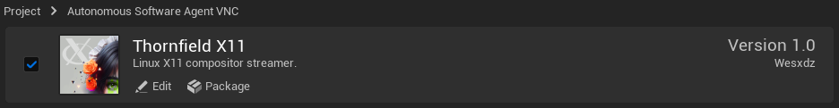
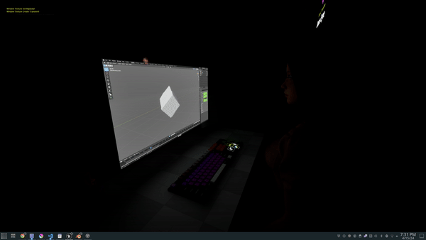

Thornfield X11 enables streaming Linux X11 windows into Unreal Engine in realtime.

Specifically, this plugin is designed for autonomous Linux desktop AI virtual network computing 3D interfaces.

This software is an alpha prototype, and needs refactors for production (like setting backing store from editor prior to begin play, and gracefully responding to window close/resize events) 
